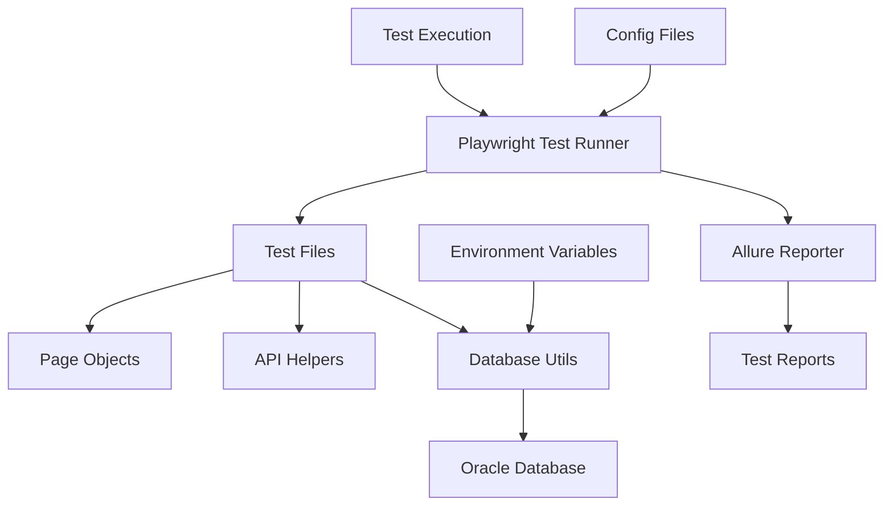
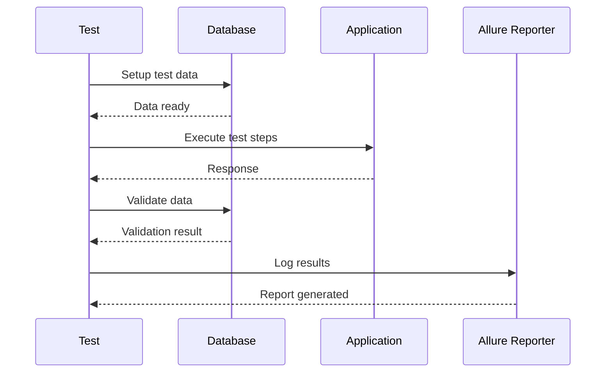

# Playwright TypeScript Automation Framework - Implementation Plan

## Overview
This document outlines the plan for creating a comprehensive Playwright TypeScript automation framework with Oracle database integration and Allure reporting capabilities.

## Framework Architecture



## Project Structure

```
Code-Prac/Framwork/
├── src/
│   ├── pages/              # Page Object Models for UI tests
│   │   ├── BasePage.ts
│   │   └── ExamplePage.ts
│   ├── api/                # API helper utilities
│   │   ├── ApiClient.ts
│   │   └── ApiEndpoints.ts
│   ├── utils/              # Utility functions
│   │   ├── DatabaseHelper.ts
│   │   ├── TestDataHelper.ts
│   │   └── Logger.ts
│   └── config/             # Configuration files
│       ├── DatabaseConfig.ts
│       └── EnvironmentConfig.ts
├── tests/
│   ├── ui/                 # UI test cases
│   │   └── example.spec.ts
│   ├── api/                # API test cases
│   │   └── example.api.spec.ts
│   └── fixtures/           # Test fixtures
│       └── baseTest.ts
├── test-data/              # Test data files
├── allure-results/         # Allure test results
├── allure-report/          # Generated Allure reports
├── playwright.config.ts    # Playwright configuration
├── tsconfig.json          # TypeScript configuration
├── package.json           # Dependencies and scripts
├── .env.example           # Example environment variables
├── .env                   # Actual environment variables (gitignored)
├── .gitignore            # Git ignore file
└── README.md             # Documentation
```

## Key Components

### 1. Database Integration
- **Oracle Driver**: Using `oracledb` npm package
- **Connection Pool**: Efficient connection management
- **Query Execution**: Helper methods for SELECT, INSERT, UPDATE, DELETE
- **Transaction Support**: Commit and rollback capabilities
- **Environment-based Config**: Credentials stored in .env file

### 2. Allure Reporting
- **Integration**: Using `allure-playwright` reporter
- **Features**:
  - Test execution history
  - Screenshots on failure
  - Step-by-step execution logs
  - Test categorization and tagging
  - Attachments support
  - Trend analysis

### 3. Test Framework Features
- **Page Object Model**: Reusable page components
- **API Testing**: REST API automation support
- **Database Validation**: Pre and post-test data verification
- **Multi-browser Support**: Chrome, Firefox, Safari, Edge
- **Parallel Execution**: Faster test execution
- **Custom Fixtures**: Shared test setup and teardown
- **Environment Management**: Multiple environment support

## Implementation Steps

### Phase 1: Project Setup
1. Initialize Node.js project with TypeScript
2. Install Playwright and dependencies
3. Install Oracle database driver
4. Set up project folder structure
5. Configure TypeScript compiler options

### Phase 2: Core Framework Development
6. Create database utility class with connection pooling
7. Implement environment configuration management
8. Set up Allure reporter integration
9. Create base test fixture with hooks
10. Implement logging utility

### Phase 3: Test Components
11. Create Page Object Model base class
12. Develop API client helper
13. Build test data management utilities
14. Create example page objects
15. Develop API endpoint configurations

### Phase 4: Sample Tests
16. Create sample UI test with database validation
17. Create sample API test with database operations
18. Add test data fixtures
19. Implement custom assertions

### Phase 5: Configuration & Documentation
20. Configure Playwright for multiple browsers
21. Set up npm scripts for test execution and reporting
22. Create comprehensive README
23. Add .gitignore for security
24. Create .env.example template

## Technology Stack

| Component | Technology | Version |
|-----------|-----------|---------|
| Test Framework | Playwright | Latest |
| Language | TypeScript | Latest |
| Database | Oracle | Compatible with oracledb |
| Reporting | Allure | Latest |
| Runtime | Node.js | 18+ |
| Package Manager | npm | Latest |

## Database Configuration

The framework will support Oracle database connections with the following features:
- Connection pooling for performance
- Environment-based configuration
- Query execution helpers
- Transaction management
- Error handling and logging

Example configuration structure:
```typescript
{
  user: process.env.DB_USER,
  password: process.env.DB_PASSWORD,
  connectString: process.env.DB_CONNECTION_STRING,
  poolMin: 1,
  poolMax: 10,
  poolIncrement: 1
}
```

## Allure Report Features

The framework will generate comprehensive Allure reports with:
- Test execution summary
- Pass/Fail statistics
- Execution timeline
- Test categorization by features
- Screenshots and logs
- Historical trends
- Retry information

## Test Execution Workflow



## Best Practices

1. **Separation of Concerns**: Keep page objects, tests, and utilities separate
2. **Reusability**: Create reusable components and helpers
3. **Data-Driven**: Use external data sources for test data
4. **Error Handling**: Implement proper error handling and logging
5. **Security**: Never commit credentials or sensitive data
6. **Documentation**: Maintain clear documentation and comments
7. **Version Control**: Use meaningful commit messages
8. **Code Quality**: Follow TypeScript best practices

## Next Steps

Once you approve this plan, I'll switch to Code mode to implement the framework with all the components outlined above. The implementation will be done step-by-step, ensuring each component is properly configured and tested.

Would you like to proceed with this plan, or would you like any modifications?